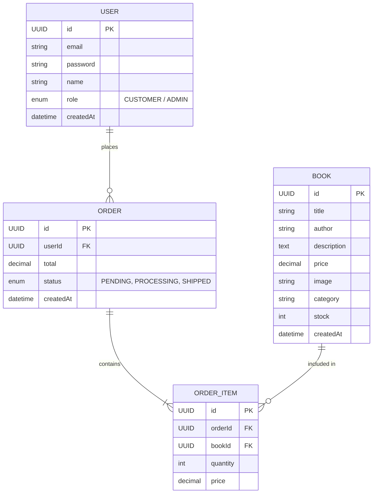

# ER Diagram

```mermaid
erDiagram
    USER {
        UUID id PK
        string email 
        string password
        string name
        enum role "CUSTOMER / ADMIN"
        datetime createdAt
    }

    BOOK {
        UUID id PK
        string title
        string author
        text description
        decimal price
        string image
        string category
        int stock
        datetime createdAt
    }

    ORDER {
        UUID id PK
        UUID userId FK
        decimal total
        enum status "PENDING, PROCESSING, SHIPPED"
        datetime createdAt
    }

    ORDER_ITEM {
        UUID id PK
        UUID orderId FK
        UUID bookId FK
        int quantity
        decimal price
    }

    %% Relationships
    USER ||--o{ ORDER : "places"
    ORDER ||--|{ ORDER_ITEM : "contains"
    BOOK ||--o{ ORDER_ITEM : "included in"
```
