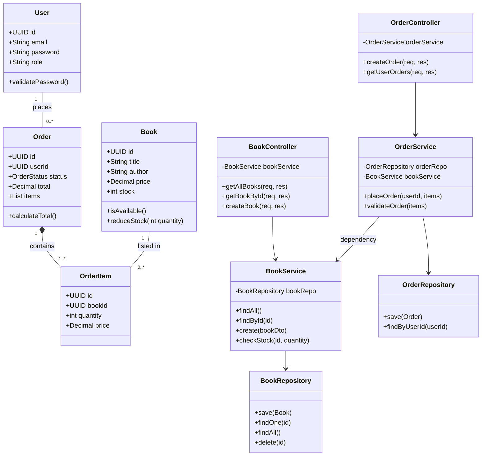

# Class Diagram (Backend Architecture)

```mermaid
classDiagram
    class User {
        +UUID id
        +String email
        +String password
        +String role
        +validatePassword()
    }

    class Book {
        +UUID id
        +String title
        +String author
        +Decimal price
        +int stock
        +isAvailable()
        +reduceStock(int quantity)
    }

    class Order {
        +UUID id
        +UUID userId
        +OrderStatus status
        +Decimal total
        +List<OrderItem> items
        +calculateTotal()
    }

    class OrderItem {
        +UUID id
        +UUID bookId
        +int quantity
        +Decimal price
    }

    %% Relationships
    User "1" -- "0..*" Order : places
    Order "1" *-- "1..*" OrderItem : contains
    Book "1" -- "0..*" OrderItem : listed in

    %% Controller Layer
    class BookController {
        -BookService bookService
        +getAllBooks(req, res)
        +getBookById(req, res)
        +createBook(req, res)
    }

    class OrderController {
        -OrderService orderService
        +createOrder(req, res)
        +getUserOrders(req, res)
    }

    %% Service Layer
    class BookService {
        -BookRepository bookRepo
        +findAll()
        +findById(id)
        +create(bookDto)
        +checkStock(id, quantity)
    }

    class OrderService {
        -OrderRepository orderRepo
        -BookService bookService
        +placeOrder(userId, items)
        +validateOrder(items)
    }

    %% Repository Layer
    class BookRepository {
        +save(Book)
        +findOne(id)
        +findAll()
        +delete(id)
    }

    class OrderRepository {
        +save(Order)
        +findByUserId(userId)
    }

    %% Architecture Links
    BookController --> BookService
    OrderController --> OrderService
    OrderService --> BookService : dependency
    BookService --> BookRepository
    OrderService --> OrderRepository

```
