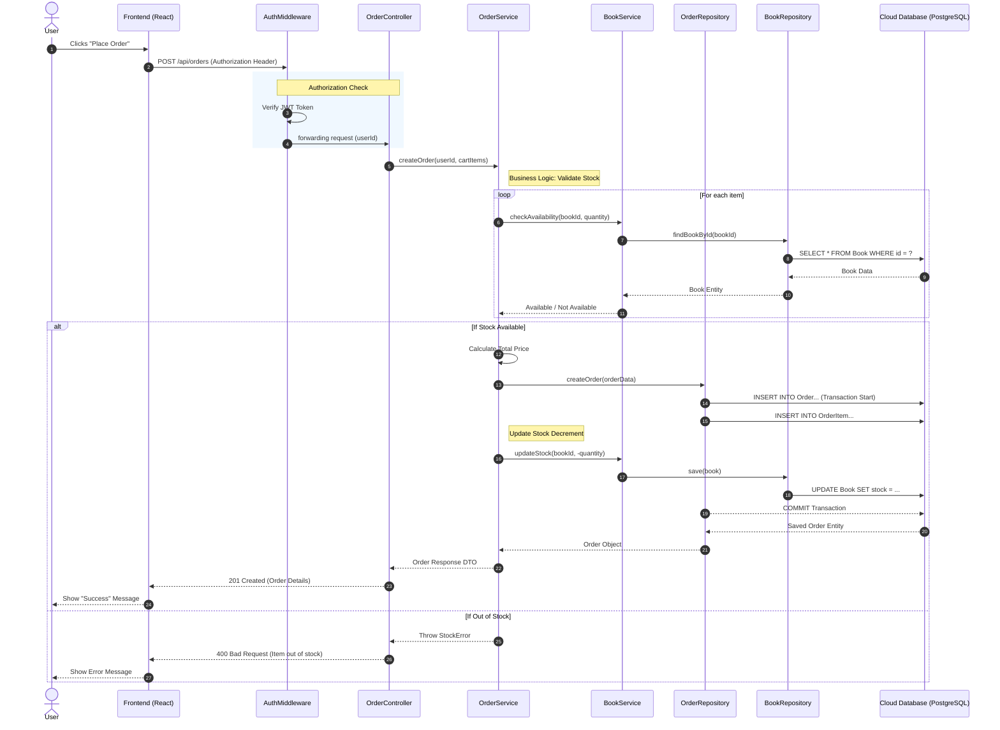

# Sequence Diagram - Order Placement Flow

```mermaid
sequenceDiagram
    autonumber
    
    actor User
    participant Client as Frontend (React)
    participant AuthMW as AuthMiddleware
    participant Ctrl as OrderController
    participant Svc as OrderService
    participant BSvc as BookService
    participant Repo as OrderRepository
    participant BRepo as BookRepository
    participant DB as Cloud Database (PostgreSQL)

    User->>Client: Clicks "Place Order"
    Client->>AuthMW: POST /api/orders (Authorization Header)
    
    rect rgb(240, 248, 255)
        Note over AuthMW, Ctrl: Authorization Check
        AuthMW->>AuthMW: Verify JWT Token
        AuthMW->>Ctrl: forwarding request (userId)
    end

    Ctrl->>Svc: createOrder(userId, cartItems)
    
    Note right of Svc: Business Logic: Validate Stock
    
    loop For each item
        Svc->>BSvc: checkAvailability(bookId, quantity)
        BSvc->>BRepo: findBookById(bookId)
        BRepo->>DB: SELECT * FROM Book WHERE id = ?
        DB-->>BRepo: Book Data
        BRepo-->>BSvc: Book Entity
        BSvc-->>Svc: Available / Not Available
    end

    alt If Stock Available
        Svc->>Svc: Calculate Total Price
        Svc->>Repo: createOrder(orderData)
        Repo->>DB: INSERT INTO Order... (Transaction Start)
        Repo->>DB: INSERT INTO OrderItem...
        
        Note right of Svc: Update Stock Decrement
        Svc->>BSvc: updateStock(bookId, -quantity)
        BSvc->>BRepo: save(book)
        BRepo->>DB: UPDATE Book SET stock = ...
        
        Repo-->>DB: COMMIT Transaction
        DB-->>Repo: Saved Order Entity
        Repo-->>Svc: Order Object
        Svc-->>Ctrl: Order Response DTO
        Ctrl-->>Client: 201 Created (Order Details)
        Client-->>User: Show "Success" Message
    else If Out of Stock
        Svc-->>Ctrl: Throw StockError
        Ctrl-->>Client: 400 Bad Request (Item out of stock)
        Client-->>User: Show Error Message
    end
```
